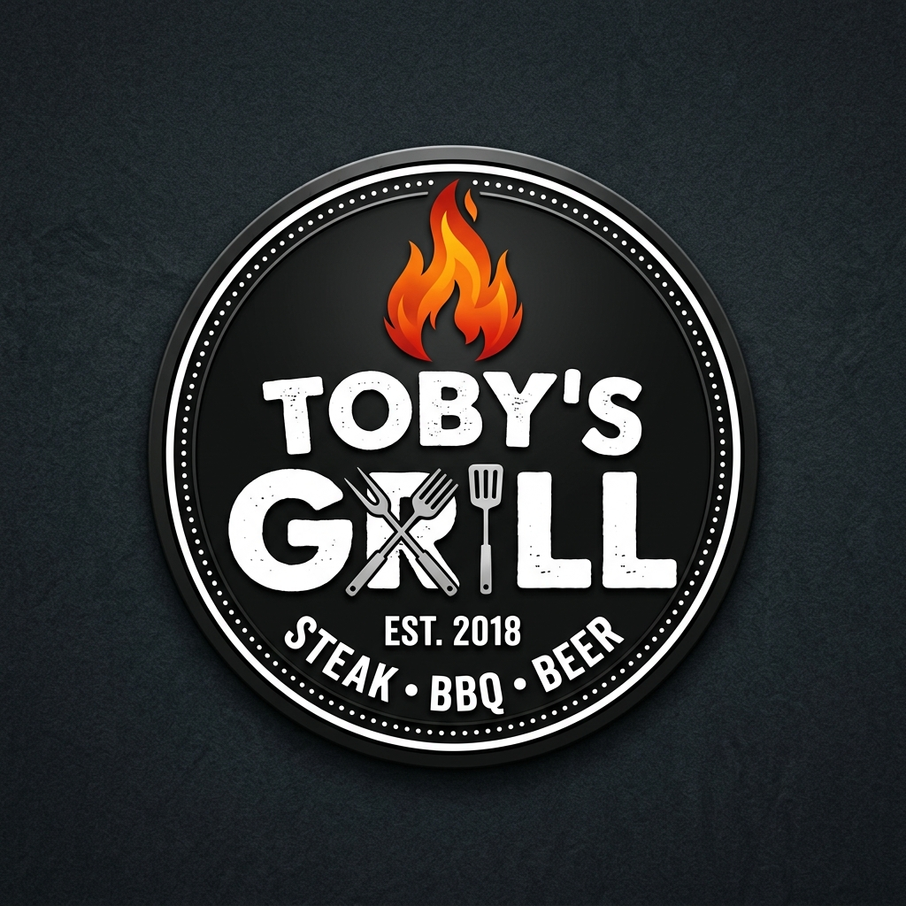

# Toby's Grill — Official Website

> **"Where Flavour Meets Fire"** 🔥  
> A polished, single-brand restaurant website for Toby's Grill — a family-run burgers, steaks, and BBQ spot in Maweni, Nyali, Mombasa, Kenya.



## 📌 Overview
Toby's Grill website is a marketing and direct-ordering funnel built to showcase the restaurant's signature flame-grilled burgers, juicy fillet steaks, house-made chimichurri sauce, and warm family hospitality.

- **Location**: Maweni, Nyali, Mombasa, Kenya (80100) — *Look for the black gate next to the American burger place nearby; private parking available on site.*
- **WhatsApp / Phone**: [+254 733 400 065](https://wa.me/254733400065)
- **Socials**:
  - Instagram: [@tobysgrill.msa](https://www.instagram.com/tobysgrill.msa)
  - TikTok: [tobysgrillmsa](https://www.tiktok.com/@tobysgrillmsa)
  - Facebook: [Toby's Grill Msa](https://www.facebook.com/tobysgrillmsa)

---

## 🔥 Features & Highlights
- **Direct WhatsApp Ordering**: One-click ordering buttons pre-filled with friendly order text for takeaway, delivery, or dine-in.
- **Interactive Menu Filter**: Browse by *Burgers*, *Steaks & Grills*, *Starters*, and *Sides & Drinks*.
- **Defensive PDF Fallback**: Interactive modal system for menu view/download with WhatsApp fallback if `menu.pdf` is not present.
- **Fullscreen Image Lightbox**: High-resolution gallery grid highlighting signature dishes and restaurant atmosphere.
- **Responsive & Fast**: Mobile-first responsive design, dark charcoal background theme (`#121212`), warm flame gradients, and smooth scroll animations.

---

## 🛠 Tech Stack
- **HTML5 & CSS3** (Vanilla CSS with design tokens & glassmorphism)
- **Vanilla JavaScript** (ES6+)
- **FontAwesome 6** & **Google Fonts** (*Outfit* & *Plus Jakarta Sans*)
- Static site designed for **GitHub Pages** deployment.

---

## 📁 Directory Structure
```
.
├── index.html              # Main website page
├── README.md               # Project documentation
├── assets/
│   ├── images/             # Visual assets & food photos
│   └── menu/               # Menu PDF/photo asset folder
├── css/
│   └── styles.css          # Design system & stylesheet
└── js/
    └── main.js             # Interactive logic & lightbox
```

---

## 🚀 Local Development
Simply clone the repository and open `index.html` in your browser, or serve locally using any static web server:

```bash
python -m http.server 8000
```

Then visit `http://localhost:8000`.

---

## 📝 Owner Content Gaps to Confirm Before Production
- [ ] Final menu pricing in KES
- [ ] Opening hours confirmation
- [ ] Live Bolt Food store URL link
- [ ] Uploading `menu.pdf` to `assets/menu/`
